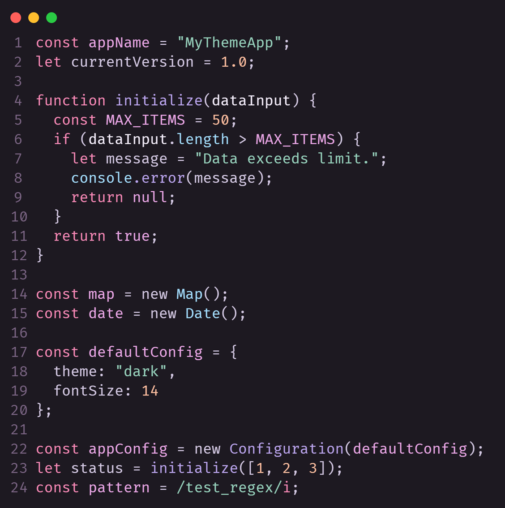

# Pinky Promise Theme

T3 Chat syntax themes, colors by Lucia Scarlet. 

[Live Demo](https://vscodethemes.com/e/ZubairIbnZamir.pinky-promise-theme/)

## Download Links
[VS Code Marketplace](https://marketplace.visualstudio.com/items?itemName=ZubairIbnZamir.pinky-promise-theme)

[Open-VSX (for any VS Code Fork)](https://open-vsx.org/extension/ZubairIbnZamir/pinky-promise-theme)

## Changelog
Changelog Available [here](./CHANGELOG.md) 

## Colors

| Usage                          | Description / Scope Example       | Hex Code                                                           |
| ----------------------------- | --------------------------------- | ------------------------------------------------------------------ |
| Comment, Regex, Bracket       | Comments, Bracket Highlighter     |  `#7a6483` |
| Keyword, Storage              | Keyword, Modifier, Heading        |  `#f888b5` |
| Constant, Entity, Decorator   | Constants, Self, This             |  `#e8a5e4` |
| Variable, Type, Name          | Variable, Type, Function Name     |  `#f2ebfa` |
| Parameter, JSX, Member        | Params, JSX Children, Object Keys |  `#d2c7e1` |
| Function, Quote               | Functions, Attribute Names        |  `#baa4ed` |
| Tag, Class Component          | Tags, Component Classes           |  `#e8a5e4` |
| String, Inserted Text         | Strings, Inserted Diff            |  `#96d0bb` |
| Support, Type, JSON Keys      | Class, Namespace, JSON Property   |  `#a2dbff` |
| Number, Color, Diff Changed   | Numbers, Colors, Diff Meta        |  `#ffbc9e` |
| Invalid, Error                | Invalid, Deprecated, Error Msg    |  `#f85149` |

## Screenshots
### JS

<!--  -->

## Acknowledgements & Credits
- Color courtesy of [Lucia Scarlet](https://gist.github.com/luciascarlet/697c8585c306cd5cfff429ba2cd6506f)
- Inspired by [T3.chat](https://t3.chat).
- Tutorial by [Coder Coder](https://www.youtube.com/watch?v=pGzssFNtWXw)
<!-- - Color Names Collected from [colorprofessor.com](https://colorprofessor.com). -->

## License

This project is open source and available under the [MIT License](LICENSE).

## More Extensions by Developer

  
   
  <a href="https://github.com/2u841r/DeleteThing">DeleteThing</a>
  

    Automatically fills deletion confirmation fields for Github, Vercel,
    Netlify, and Cloudflare Pages
  

   

  
   
  <a href="https://github.com/2u841r/bytes-newsletter-theme">
    Bytes Newsletter Theme
  </a>
  
A vibrant Visual Studio Code theme inspired by Bytes newsletter

   

  
   
  <a href="https://github.com/2u841r/svelte-theme-v5">Svelte Theme v5</a>
  
Svelte Theme, inspired by Svelte Docs

